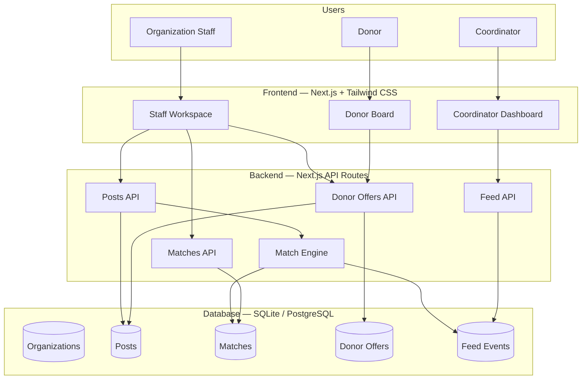
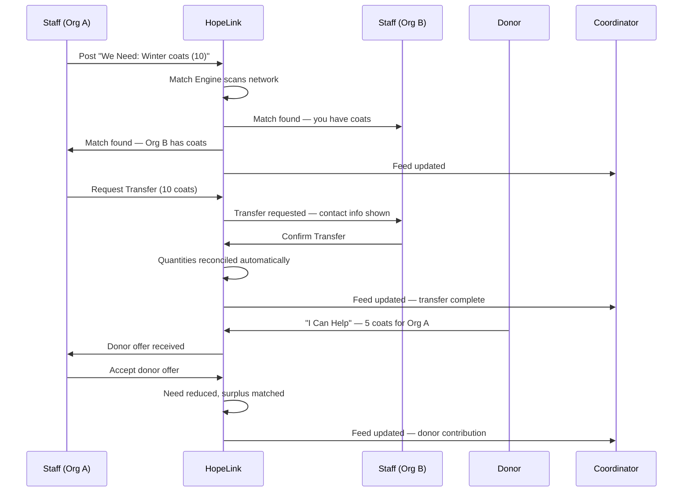

# HopeLink

**See needs. Match resources. Reduce waste.**

Real-time donation coordination for the Greater Moncton Homelessness Steering Committee (GMHSC) network.

Hack4Change 2026 | March 13-15 | Venn Innovation, Moncton


## The Problem

28 organizations in the GMHSC network coordinate donated goods through phone calls, texts, and emails. There is no shared visibility into what's available, what's needed, or what's expiring.

The result:
- Shelters are overstocked while others face shortages
- Time-sensitive items expire before they can be redistributed
- Staff spend hours on manual coordination calls

~550 people experiencing chronic homelessness in Greater Moncton depend on this network working efficiently.

## Our Solution

HopeLink is a lightweight coordination hub that gives every GMHSC organization instant visibility into needs, surplus, and urgent shortages across the entire network.

A smart match engine automatically connects surplus to shortage before items go to waste.

HopeLink does not replace communication between organizations. It tells them **who to call and why**.
ß

## Impact

- **Faster coordination**: organizations see matches instantly instead of making phone calls
- **Less waste**: expiring items are flagged and matched before they spoil
- **Better visibility**: coordinators see network health at a glance
- **Easier donations**: donors see real-time needs and respond in under 30 seconds
- **Zero cost**: no subscriptions, no external services, no app installs

## Key Features

### Role-Based Entry
Three clear paths from the landing page: Staff, Coordinator, and Donor. Each role sees exactly the tools they need.

### Organization Staff Workspace
- **We Have / We Need**: two-button interface to post available items or needs in under 30 seconds
- **Available Items**: view all surplus items the organization has posted
- **Active Needs**: view all current needs with urgency levels
- **Organization Activity History**: recent actions affecting this organization
- **Donor Offers**: incoming offers from public donors, with one-click accept

### Smart Match Engine
When a need is posted, HopeLink automatically finds matching surplus from other organizations. Matches are prioritized by urgency (critical first) and expiry (soonest-expiring matched first). Deterministic category-based matching, no AI, no black boxes.

### Transfer Request Workflow
When a match is found, the organization in need can request a transfer. The providing organization sees the request with contact details, coordinates directly, and confirms in the system. No central approval needed, organizations decide for themselves.

### Automatic Quantity Reconciliation
When a transfer is confirmed or a donor offer is accepted:
- Transfer amount = `min(surplus, need)`
- Both post quantities update automatically
- Posts with quantity 0 are resolved and removed from active views
- Remaining surplus stays available for other matches
- Orphaned pending matches are auto-dismissed

### Coordinator Dashboard (Read-Only)
- **Network Overview**: all organizations color-coded by status (green / yellow / red)
- **Network Pulse Metrics**: active needs, available items, match rate, expiring items
- **Live Activity Feed**: real-time stream of posts, matches, transfers, and alerts
- **PDF Report Export**: one-click formatted report for board meetings and grant applications

### Public Donor Board
- View current network needs aggregated by category and urgency
- **"I Can Help"** form tied to a specific organization's need
- Choose pickup, delivery, or either
- Optional photo upload
- No account required

### Expiry Countdown
Items with expiry dates show visual countdown badges. Items within 72 hours of expiry are flagged and prioritized for matching.

### Mobile-Friendly Interface
Every screen is designed for mobile-first use. Large touch targets, responsive layouts, and minimal input fields — built for a shelter worker at midnight on their phone.


## How It Works

**For a shelter worker (30 seconds):**
1. Open HopeLink on any device, enter your organization code
2. Tap **"We Need"** : select category, item, quantity, urgency
3. HopeLink instantly searches the network for a match
4. If a match exists, tap **"Request Transfer"**: the other org sees the request
5. After coordinating directly, the providing org confirms and ßquantities update automatically

**For a coordinator (3 seconds):**
1. Open HopeLink, select **"Coordinator"**, enter coordinator code
2. See all organizations color-coded: red = critical, yellow = active needs, green = well stocked
3. Scroll the live feed to see matches, posts, and alerts in real time
4. Export a PDF report for board meetings

**For a donor (10 seconds):**
1. Visit the public **Donor Board** — no login needed
2. See what the network needs right now, sorted by urgency
3. Tap **"I Can Help"** on a specific need, fill in details, done

## System Architecture



## User Flow




## Tech Stack

| Layer | Technology |
|||
| Frontend | Next.js 14 (App Router) + Tailwind CSS |
| Backend | Next.js API Routes |
| Database | SQLite via Prisma ORM (PostgreSQL-ready) |
| Language | TypeScript |
| Hosting | Vercel (free tier) |
| Reports | Client-side PDF generation (zero dependencies) |

**Why this stack:**
- **Single deployable unit** — frontend and backend in one repo, one deploy command
- **SQLite for dev, PostgreSQL for production** — zero database setup during development
- **Vercel free tier** — zero ongoing hosting cost, auto-deploys from GitHub
- **No external API dependencies** — fully self-contained

## Setup

### Prerequisites
- Node.js 18+
- npm

### Quick Start

```bash
git clone [repo-url]
cd hopelink
npm install
npm run setup
npm run dev
```

Open [http://localhost:3000](http://localhost:3000)

### Commands

| Command | Description |
|||
| `npm run dev` | Start development server |
| `npm run build` | Build for production |
| `npm run setup` | Generate Prisma client, push schema, seed demo data |
| `npm run db:seed` | Re-seed demo data |
| `npm run db:reset` | Reset database and re-seed |


## Demo Codes

**Coordinator:** `gmhsc-coord`

### Organization Codes

| Code | Organization | Type |
||||
| `hou-naz` | House of Nazareth | Shelter |
| `ymca-gm` | YMCA Greater Moncton | Outreach |
| `cross-wo` | Crossroads for Women | Shelter |
| `harv-atl` | Harvest House Atlantic | Shelter |
| `rise-tid` | Rising Tide | Service |
| `salvus` | Salvus | Service |
| `ywca-mon` | YWCA Moncton | Shelter |
| `jhs-senb` | John Howard Society | Service |
| `hdc-monc` | Human Development Council | Coordinator |
| `youth-ij` | Youth Impact Jeunesse | Service |


## Privacy by Design

- **Tracks items, not people.** No personal information about individuals experiencing homelessness is collected or stored.
- **Minimal personal data.** Only donor contact information (name, email/phone), voluntarily provided.
- **No tracking or analytics.** No cookies, no user tracking, no analytics services.
- **Organization-level access.** Staff access via organization codes — no individual user accounts.
- **Data stays local.** All data stays on the hosting server. No third-party data processors.

## Deployment

1. **Push to GitHub**: auto-deploys to Vercel
2. **Distribute org codes**: to member organizations
3. **Staff access via URL**: on any device — no app install required
4. **Estimated onboarding:**: under 5 minutes per organization

**Total operational cost: $0/month**

### Production Considerations
- Migrate from SQLite to PostgreSQL (one config change)
- Add email notifications for matches
- Add service worker for offline resilience

## AI Disclosure

This project used AI tools during development:

- **ChatGPT**: Architecture planning, code generation assistance, pitch narrative development
- **Claude**: Code generation, debugging, feature implementation

All AI-generated code was reviewed, tested, and modified by team members. The problem analysis, design decisions, and final pitch content reflect the team's own understanding of the challenge.

AI tools were used transparently as productivity multipliers — not as a substitute for understanding the problem or the users we're building for.
